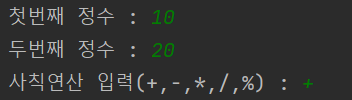
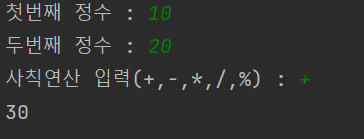
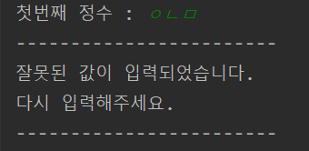
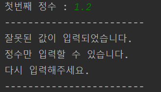
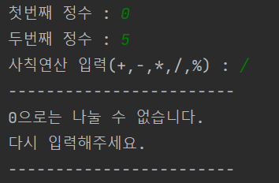
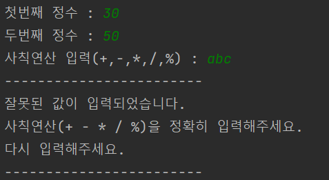

# 자바 계산기 연습

---
- `boolean` 값을 통해 `while문`을 통제할 수 있다.
- `try`, `catch`를 통해 예외처리
- 잘못된 값을 입력했을 경우, 무한 반복

<br>
<br>

#### 1. Scanner를 통해 값을 입력을 받는다.



<br>
<br>

#### 2. 정상적으로 값을 받으면 결과 출력 후 종료



<br>
<br>

#### 3. 잘못된 값을 입력 받았으면 오류 메세지 출력 후 재입력



<br>
<br>

---

### 예외 상황

1. 정수 입력이 아닌 실수, 문자, 문자열을 입력했을 경우
> - `InputMismatchException` 발생 <br>
> - `try ~ catch`를 통해 예외 처리



<br>

2. 정수에 `0`을 입력했고 사칙 연산이 `/` 혹은 `%`를 입력했을 경우
> - `checkZero`메소드 실행하여 판별 후 `ArithmeticException` 발생 <br>
> - `try ~ catch`를 통해 예외 처리



<br>

3. 사칙 연산 입력이 아닌 어떠한 다른 값을 입력했을 경우
> - `switch`의 `default`를 통해 `RuntimeException` 발생
> - `try ~ catch`를 통해 예외 처리




<br>

### 예외 상황에 대한 처리

- `true` 값을 가진 `con` 전역 변수 생성
```java
    public class app1 {
    private boolean con;

    public static void main(String[] args) {
        ...
        
        app.con = true;
        
        ...
```

- `try~catch`를 `while`로 감싼 형태의 코드로 작성하여 각각의 상황에 대처함.
```java
while(app.con){
    try{
        ...
        app.con = false;
        }
    catch(Exception e){
        ...
        in.nextLine();
        }
}
```
- `catch`에 진입 시, 예외상황 대한 처리를 해주고 `in.nextLine();`을 통해 입력 버퍼를 비워 `while문`이 무한히 반복되는 현상을 방지했다. 
- 모든 예외 상황을 문제없이 통과하면 `con = false;`로 반복문이 종료되게끔 구성했다.


